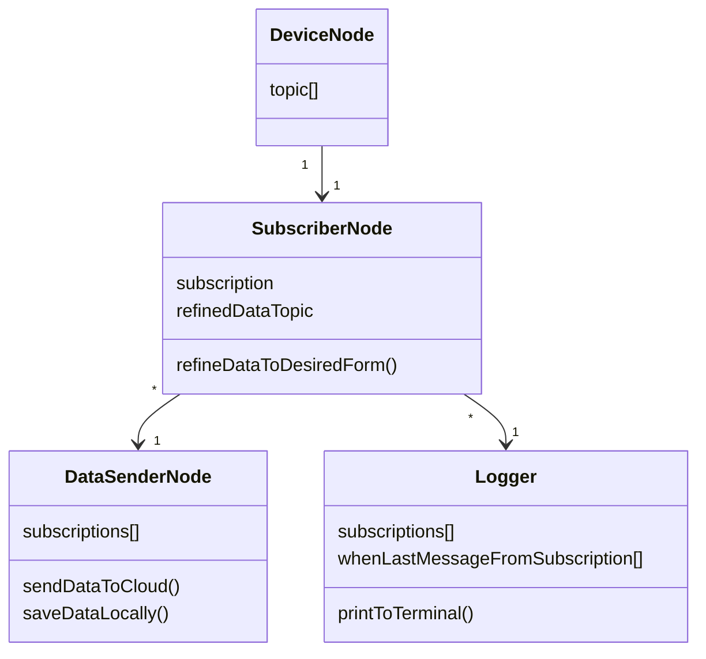

# ros-device-control

## Dependencies

```bash
# Do not care if this says you have already created it, its okay.
rosdep init

# Update
rosdep update

# Install package dependencies (Must be run in the ROOT folder).
rosdep install --from-paths src -y --ignore-src
```

## Building

```bash
# This must be run in the ROOT directory
colcon build
```

## Running
The package names can be found in src/<project-folder>/package.xml. 
There is a line called "name" which tells the name of the specific package.

This is not to be confused with the folder name which can be whatever.
Only name that matters is the name in the package.xml.

Ros run will autocorrect the package names so they don't always need to be fully typed.

```bash
ros2 run <package-name> <node-name>
```

## Docker

Easy to setup just build the image from Dockerfile and run.

The run command displayed here will use the host computers network
and forward the device /dev/video0 to the container and its name will be
/dev/video4 inside the container. Both of these names can be changed depending
on where the device actually lands on your computer.

```bash
# Build image
docker build -t ros-devices .

# Run container
docker run --device=/dev/video0:/dev/video4 --network=host ros-devices:latest
```

## ROS node architecture


